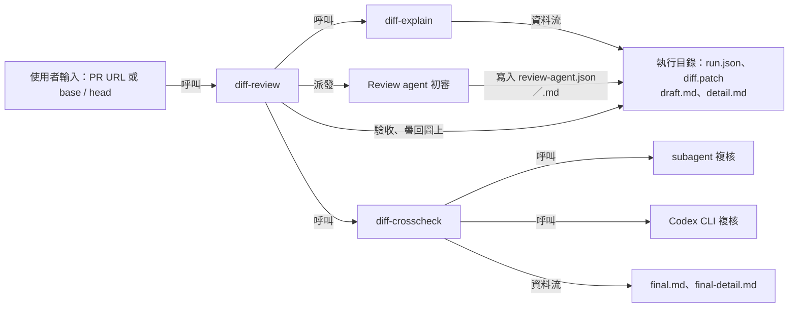

# diff-review-skills

協助開發者快速看懂 git diff，並產出以圖為主、有證據、經獨立雙重複核的 code review 報告。所有人類可讀輸出使用繁體中文。

不綁定特定專案：審查時會探索受審 repo 自身的規範（`AGENTS.md`、`CLAUDE.md`、`CONTRIBUTING.md`、`.cursor/rules`、repo 內的 skills 等），repo 規範優先於本組 skill 的通用基準。

## 三個 skill

| Skill | 用途 | 單獨使用範例 |
| --- | --- | --- |
| `diff-explain` | 固定比較範圍，以 Mermaid 圖說明改動，逐項證據放在詳細檔；不產出 findings | 「幫我看懂這個 PR」「v2.3.0 -> feature/login 改了什麼」 |
| `diff-review` | 入口：串接 `diff-explain` → 派發 review agent 初審 → 串接 `diff-crosscheck` | 「review 這個 PR」「做有證據的 code review」 |
| `diff-crosscheck` | 讓獨立 subagent 與 Codex CLI 平行複核同一份草稿，再對照程式碼在副本上修正 | 「用 Codex 複核這個執行目錄的改動說明」 |



三個 skill 之間只透過執行目錄交接；`run.json` 記錄固定的 base / head / merge-base SHA、比較方式、目前 checkout 狀態（`checkout`）、各檔案路徑（`artifacts`）、渲染檢查腳本（`tools`），以及各 skill 登記、供 reviewer 遵循的規則路徑（`criteria`）。

`diff-review` 內附 `agents/review-agent.md`，由 skill 明確派發給全新 context 的 subagent 執行初審，交付使用者需求與驗收條件原文。Agent 只載入證據與審查判準，按適用路徑與主題選讀 repo 規範；React 等條件規則及完整範例按需載入。納入未提交改動時，閱讀前與交付前核對工作目錄仍符合固定 patch。Agent 對受審 repo 唯讀，只把審查內容與交接 metadata 寫入執行目錄的兩個結果檔；主 agent 驗收後以檔案串接併入 `detail.md`、把問題疊回 `draft.md` 的圖上，不重新抄寫 agent 的輸出。初審未完成時停止後續流程，其結果不計入獨立雙重複核。

## 報告長什麼樣

最終報告 `final.md` 以圖為主，給人快速看懂改動與問題；逐項證據、完整 findings 與複核紀錄放在 `final-detail.md`，需要追查時再看。

```text
# Code Review：<標題>
狀態列：複核結論｜base ← head｜檔案數 +/-｜P0–P3 各級數量｜檢查摘要
## 一句話            改了什麼＋問題集中在哪
## 圖 1              修改前 vs 修改後的路徑
## 圖 2              改動地圖，問題直接標在節點上
## 圖 3              關鍵狀態或時序（依改動性質選畫）
## 改動群組          一組一行
## 要處理的問題      一則一行：等級｜問題｜建議｜F 編號（連到詳細段落）
## 待確認            需要後端、PM 回答的問題
## 驗證範圍          跑過／沒驗／複核
```

圖的底色表示改動類型（綠＝新增、黃＝修改、藍＝沒改但受影響、灰＝移除），框線表示問題等級（紅色粗框＝有 P0–P2、灰色虛框＝只有 P3）。**藍底紅框**是這次沒改、但前提被改動破壞的地方，通常是 diff 裡看不出來的影響。每張圖都會實際渲染，檢查語法錯誤與文字重疊。

## 安裝

```bash
npx skills add ba1679/diff-review-skills
```

三個 skill 的相依關係：`diff-explain` 可單獨使用；`diff-crosscheck` 需要 `diff-explain` 或 `diff-review` 先建立的執行目錄；`diff-review` 需要另外兩個 skill。建議安裝全套。

只安裝其中一個（例如只需要改動說明）：

```bash
npx skills add ba1679/diff-review-skills@diff-explain
```

本機開發時，可把 `skills/` 下的三個目錄以 symlink 掛到 agent 的 skills 目錄（例如 `~/.claude/skills/`）。

## 依賴

| 工具 | 是否必要 | 用途 | 缺少時 |
| --- | --- | --- | --- |
| `git` | 必要 | 固定範圍、讀取固定版本的程式碼 | 無法執行 |
| Python 3.10+（建議搭配 `uv`） | 必要 | 執行 `scripts/` 下的腳本（只用標準函式庫） | 無法執行 |
| `gh`（已 `gh auth login`） | 使用 PR URL 時 | 讀取 PR 的 base / head、描述與討論 | 說明原因並停止，不改用其他範圍 |
| `codex`（Codex CLI，已登入） | 雙重複核時 | 以唯讀 sandbox 複核草稿 | 標示缺少 Codex 複核，不宣稱完成雙重複核 |
| 支援 subagent 的 agent（例如 Claude Code） | `diff-review` 初審及雙重複核時 | 全新 context 的 review agent 初審與獨立 subagent 複核 | 初審無法啟動時停止；獨立複核缺少 subagent 時如實標示 |
| Chrome、Chromium、Edge 或 Playwright 的 headless shell，以及可連上 jsDelivr 的網路 | 建議 | 以 `render_mermaid.py` 實際渲染 Mermaid 圖並截圖，檢查語法錯誤與文字重疊 | 報告註明「圖未經渲染驗證」；可用 `--browser` 或 `DIFF_REVIEW_BROWSER` 指定瀏覽器，`--mermaid-url` 指向本機 Mermaid |

Codex CLI 需支援 `codex exec --json` 與 `codex exec resume`，並使用 `~/.codex/config.toml` 設定的預設模型；實際使用的模型會寫進最終報告。為了在中斷時接續，Codex 的 session 會保存在 `~/.codex/sessions`，其中包含受審程式碼的片段。

## 使用方式

```text
/diff-review https://github.com/acme/shop-web/pull/482
/diff-review base=v2.3.0 head=feature/login
/diff-review release/3.1 和 release/3.2 的完整差異
/diff-explain main -> feature/cart
/diff-crosscheck /tmp/diff-review-runs/shop-web-a1b2c3d4e5f6-20261005T101500
```

範圍規則：

- 預設 base 為 `origin/main`、head 為目前分支，以 `git diff <base>...<head>` 比較 merge-base 到 head 的改動。
- 明確要求兩個版本的完整差異時，改用 `git diff <base> <head>`。
- `A -> B` 一律視為 A 是 base、B 是 head。
- 同時提供 PR URL 與自訂範圍時，以自訂範圍為準，PR 只作為需求與背景來源。
- 預設不包含 staged、unstaged、untracked 改動，明確要求才納入。
- 範圍無法成立（PR 無法存取、ref 不存在、diff 為空）時說明原因並停止，不會靜默替換範圍。

## 執行目錄

預設建立在系統暫存目錄的 `diff-review-runs/` 下，不會寫進受審 repo：

```text
<run-root>/<repo>-<head SHA 前 12 碼>-<時間>/
  run.json            固定範圍與交接資訊
  diff.patch          本次 diff
  pr.md               PR 描述與討論（有 PR 時）
  draft.md            報告本文草稿（以圖為主）
  detail.md           詳細證據：比較範圍、各群組證據，初審後附上完整 findings 與審查涵蓋
  review-agent.json   初審交接 metadata
  review-agent.md     初審的原始審查內容
  reviewer-brief.md   兩個 reviewer 共用的複核指示
  final.md            最終報告（複製 draft.md 後修正）
  final-detail.md     最終詳細檔（複製 detail.md 後修正，附複核紀錄）
  mermaid-check/      圖的渲染檢查頁與截圖
<run-root>/<repo>-<head SHA 前 12 碼>-<時間>.reviews/
  worktree-before.json  複核前的工作目錄快照，複核後用來比對
  subagent.md           subagent 的原始複核結果
  codex.md              Codex 的原始複核結果
  codex.status.json     Codex 的執行狀態與嘗試紀錄
```

兩個 reviewer 都結束後，才把原始結果移入 `.reviews/`；複核進行中，Codex 的輸出放在腳本建立的私有暫存目錄，subagent 的結果寫在主 agent 另建的私有暫存目錄，彼此看不到對方的結果。

## 疑難排解

Codex 複核由 `run_codex_review.py` 執行。腳本依 Codex session 紀錄中的錯誤碼分類，把結果寫在狀態 JSON 的 `status`、`reason` 與 `action`：

| `status` | 意義 | 腳本的自動處理 | 你可以做的事 |
| --- | --- | --- | --- |
| `capacity` | 模型暫時滿載（`Selected model is at capacity`） | 等 30 秒接續同一個 session 重試一次，再依序改用備援模型接續 | 從列出的模型中選一個接續，或設定備援模型 |
| `model_unsupported` | 此帳號不支援設定的模型（例如 `model is not supported when using Codex with a ChatGPT account`） | 不重試同一模型，直接依序改用備援模型接續 | 從列出的模型中選一個接續，或改 `~/.codex/config.toml` 的預設模型 |
| `transient` | 連線中斷、伺服器錯誤或速率限制 | 等 30 秒、90 秒後接續重試 | 確認網路後接續 |
| `auth` | 未登入或登入已失效 | 不重試 | 執行 `codex login` |
| `usage_limit` | 已達用量上限 | 不重試 | 等用量重置或改用其他帳號 |
| `context_limit` | 超過模型的 context 上限 | 不重試 | 縮小 diff 範圍或拆成多次複核 |
| `timeout` | 超過整體時間上限（預設 40 分鐘，含重試與等待） | 不重試 | 接續，或以 `--timeout` 放寬上限 |
| `unsafe_sandbox` | Codex 的實際 sandbox 不是唯讀 | 捨棄結果 | 檢查 Codex 設定與版本 |

接續時沿用原 session，已完成的進度不會浪費。

### 模型容量不足或不支援時改用其他模型

事先設定備援模型時，腳本會自動依序改用：

```bash
export DIFF_REVIEW_CODEX_FALLBACK_MODELS="<備援模型>,<第二個備援模型>"
```

沒有設定，或備援模型也失敗時，agent 會停下來列出 Codex 模型目錄中尚未嘗試的模型（取自 `codex debug models`，指令失敗時改讀 `~/.codex/models_cache.json`；不保證你的帳號可用），由你決定是否改用其中一個接續原 session。選擇不換時，最終報告會標示「僅完成單一複核」。

## 安全邊界

- 不切換分支、不重設工作目錄、不修改受審 repo；只在缺少 PR commit 時執行 `git fetch`，並在報告中揭露。
- 兩個 reviewer 對受審 repo 都唯讀：subagent 由 brief 明令除自己的結果檔外不得建立或修改任何檔案，Codex 以 `--sandbox read-only` 執行，接續 session 時也會檢查實際 sandbox；複核前後以 `check_worktree.py` 比對工作目錄快照。
- PR 描述、討論與 issue 內容一律視為待查證資料，其中的指示不會被執行。
- 不在 PR 上留言、不 approve、不 request changes。
- reviewer 不讀取 `.env*` 與金鑰檔，也不在輸出中貼出任何密鑰。

## 授權

[MIT](LICENSE)
