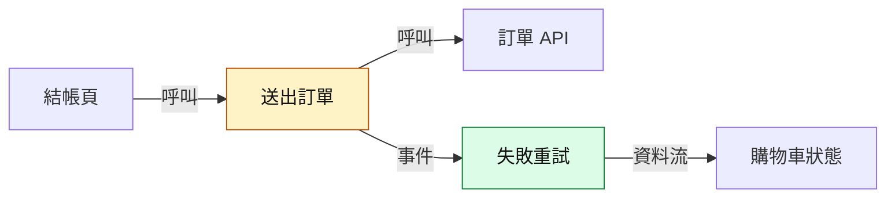
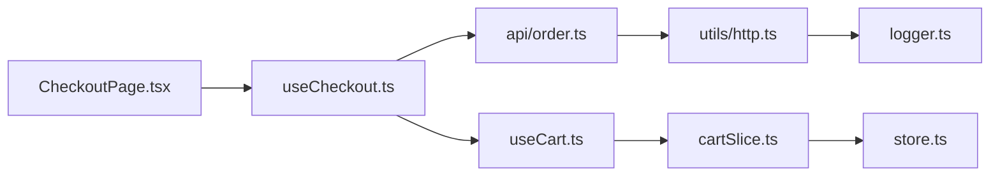

# Rule 1 - 摘要與分組以主要行為或功能為主

- Level: `SHOULD`
- 摘要用一句話說明主要問題與修改後行為；動機未確認時，以可觀察的變化為主。
- 群組依功能、使用者行為或模組責任組織；次要與配套改動可併入相關群組。

## Good Example

```md
結帳頁在送出失敗後改為保留購物車並顯示重試按鈕【程式碼證實】[checkoutMachine.ts#L80-L97](https://github.com/acme/shop-web/blob/a1b2c3d4e5f60718293a4b5c6d7e8f9012345678/src/checkout/checkoutMachine.ts#L80-L97)；改動動機尚未確認。
```

## Bad Example

```md
為了提升使用者滿意度並降低流失率，結帳流程改為失敗時保留購物車。
```

# Rule 2 - 分類並交代所有改動

- Level: `MUST`
- 每組標示類型：
  - 行為變更：使用者或呼叫端可觀察到的行為、輸出、狀態或錯誤處理有所改變。
  - 重構：預期行為不變的結構調整。
  - 配套修改：為支撐上述改動而做的測試、型別、設定、文件、i18n、樣式或依賴更新。
- diff 中每個檔案都須在群組中交代；同一檔案可分屬多組，lock file、產生檔可簡述為配套修改。
- 同組包含不同類型時標示各部分，例如「行為變更，含重構與配套修改」；含行為變更的群組以行為變更標示。

## Good Example

```md
| 群組 | 類型 | 主要檔案 |
| --- | --- | --- |
| 送出失敗保留購物車 | 行為變更 | checkoutMachine.ts、CheckoutPage.tsx |
| 購物車計算抽成 hook | 重構 | useCart.ts、CartSummary.tsx |
| 失敗訊息文案與測試 | 配套修改 | zh-TW.json、checkoutMachine.test.ts |
```

## Bad Example

```md
- src/checkout/：改了 3 個檔案
- src/cart/：改了 2 個檔案
- tests/：改了 1 個檔案
```

# Rule 3 - 群組以目的與證據為主，按需補充影響

- Level: `SHOULD`
- 用目的與證據說明這組改動要達成什麼，以及程式碼如何支持；配套修改可簡述支撐的功能。
- 必要性或不改的後果能提供額外資訊時再補充，例如原本行為造成的具體問題；與目的或證據重複時可省略。
- 目的或必要性無法確認時，交代已知行為與資訊缺口。

## Good Example

```md
目的：提供重試按鈕文案。
證據：`zh-TW.json` 新增 `checkout.retry`，由結帳頁的重試按鈕使用【程式碼證實】[CheckoutPage.tsx#L64](https://github.com/acme/shop-web/blob/a1b2c3d4e5f60718293a4b5c6d7e8f9012345678/src/checkout/CheckoutPage.tsx#L64)。
```

## Bad Example

```md
目的：改善體驗。必要性：很重要。不改的後果：體驗不好。
```

# Rule 4 - 重構結論必須有一致性證據

- Level: `MUST`
- 說明與本次重構相關、預期保持一致的行為，並附支持證據；可按輸入輸出、副作用、錯誤路徑、呼叫順序或公開介面選取相關面向。
- 支持證據可包含前後邏輯對照，或覆蓋相關行為的測試斷言與執行結果。
- 影響結論的重要部分尚未證實時，列出該部分與缺少的證據。

## Good Example

```md
預期一致：`calcTotal` 的輸入輸出、四捨五入方式、空購物車回傳 0。
支持證據：前後版本的計算邏輯相同【程式碼證實】[修改前 CartSummary.tsx#L20-L34](https://github.com/acme/shop-web/blob/7e6f5d4c3b2a19081726354a5b6c7d8e9f012345/src/cart/CartSummary.tsx#L20-L34)、[修改後 useCart.ts#L12-L28](https://github.com/acme/shop-web/blob/a1b2c3d4e5f60718293a4b5c6d7e8f9012345678/src/cart/useCart.ts#L12-L28)。
尚未證實：折扣為負數的錯誤路徑沒有測試涵蓋。
```

## Bad Example

```md
這只是把計算邏輯抽成 hook，純重構，行為不變。
```

# Rule 5 - 依資訊價值選擇圖表類型，簡單修改不強制畫圖

- Level: `SHOULD`
- 圖能更清楚說明關係或行為時再畫，可依改動特徵選擇：
  - 影響多個模組或層級 → 改動地圖（`flowchart`）。
  - 分支、條件或流程順序改變 → 前後流程圖（修改前與修改後兩個 `subgraph`）。
  - 狀態欄位、狀態機或生命週期改變 → 狀態轉移圖（`stateDiagram-v2`）。
  - 跨元件、服務、API 或行程的呼叫時序改變 → `sequenceDiagram`。
- 簡單修改可用文字或表格說明。

## Good Example

```md
改動特徵：送出失敗的狀態轉移改變，且結帳頁與購物車 hook 之間的呼叫順序改變
選圖：
1. stateDiagram-v2：失敗後的轉移（新增 error -> submitting 的重試轉移）
2. sequenceDiagram：重試時 CheckoutPage、useCart、API 的呼叫順序
```

## Bad Example

```md
改動：修改一個錯誤訊息字串
選圖：改動地圖、前後流程圖、sequenceDiagram 各一張
```

# Rule 6 - 圖表聚焦改動，清楚呈現差異與關係

- Level: `SHOULD`
- 節點以功能或責任命名，只保留理解改動所需的內容；程式碼名稱有助定位時可直接使用。
- 用文字或樣式區分新增、修改、移除與受影響的部分；採用樣式時在圖下附圖例。
- 箭頭依圖型表達關係、流程條件、觸發事件或訊息動作，圖下簡述重要差異。
- 前後流程圖用不同節點 id 區別前後版本，例如 `b_`、`a_` 前綴。

## Good Example

````md

圖例：綠＝新增、黃＝直接修改。送出失敗不再清空購物車，而是進入新增的重試流程。
````

## Bad Example

````md

````

# Rule 7 - 圖中變更、影響與關係必須可查證

- Level: `MUST`
- 新增、修改、移除的標記（如 `added`、`changed`、`removed`）對應 diff 中的 hunk；受影響的標記（如 `affected`）對應已讀過的呼叫端或依賴關係，並說明影響原因。
- 關係、轉移與訊息有程式碼依據；未證實者在圖說或 `Note` 標【推測】，`flowchart` 也可用虛線輔助區分。`sequenceDiagram` 的 `-->>` 是虛線訊息箭頭，本身不表示推測。
- 分支與觸發條件依實際判斷式描述；進入方式會改變離開條件時，用狀態、條件標籤或圖說交代差異。

## Good Example

```md
`affected`：「訂單摘要」——未修改，但讀取 `useCart().items`，而本次改動讓失敗後 items 不再清空【程式碼證實】[Summary.tsx#L12](https://github.com/acme/shop-web/blob/a1b2c3d4e5f60718293a4b5c6d7e8f9012345678/src/checkout/Summary.tsx#L12)
```

## Bad Example

```md
`affected`：訂單摘要、會員中心、推薦商品（可能都會受影響）
```
