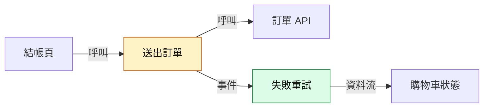
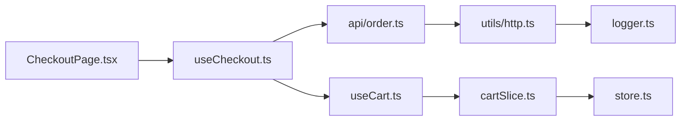

# Rule 1 - 用一句話說明問題與修改後行為，動機不明就直接標示

- Level: `MUST`
- 一句話的形式為「為了 <要解決的問題或目標>，<修改後的行為>」。
- 有需求來源時，問題描述以需求措辭為準；只能從程式碼推論時，必須標【推測】。
- 看不出動機時，改寫為「動機不明：<可觀察到的行為變化>」，不可為了句子完整而編造動機。
- 一句話只描述最主要的改動；次要改動留給功能分組說明。

## Good Example

- 這個例子是好的，因為它在動機不明時直接標示，只描述能證實的行為。

```md
動機不明：結帳頁在送出失敗後不再自動清空購物車，改為保留內容並顯示重試按鈕。
```

## Bad Example

- 這個例子是壞的，因為它為了讓句子完整而編造了沒有任何證據的動機。

```md
為了提升使用者滿意度並降低流失率，結帳流程改為失敗時保留購物車。
```

# Rule 2 - 依功能分組，並標示每組是行為變更、重構或配套修改

- Level: `MUST`
- 依功能或使用者可感知的行為分組，不依檔案或目錄分組。
- 每組必須標示類型：
  - 行為變更：使用者或呼叫端可觀察到的行為、輸出、狀態或錯誤處理有所改變。
  - 重構：預期行為不變的結構調整，例如改名、搬移、抽取、拆分、型別調整。
  - 配套修改：為支撐上述改動而做的測試、型別、設定、文件、i18n、樣式或依賴更新。
- 同一個檔案可以分屬多組；diff 中的每個檔案都必須落到某一組，不可靜默略過。lock file、產生檔可以歸入配套修改並簡述。
- 同一組內同時含行為變更與重構時，拆成兩組，避免重構掩蓋行為變更。

## Good Example

- 這個例子是好的，因為它依行為分組，並把混在同一檔案的重構與行為變更分開。

```md
| 群組 | 類型 | 主要檔案 |
| --- | --- | --- |
| 送出失敗保留購物車 | 行為變更 | checkoutMachine.ts、CheckoutPage.tsx |
| 購物車計算抽成 hook | 重構 | useCart.ts、CartSummary.tsx |
| 失敗訊息文案與測試 | 配套修改 | zh-TW.json、checkoutMachine.test.ts |
```

## Bad Example

- 這個例子是壞的，因為它按目錄列出檔案，讀者看不出哪些改動會改變行為。

```md
- src/checkout/：改了 3 個檔案
- src/cart/：改了 2 個檔案
- tests/：改了 1 個檔案
```

# Rule 3 - 每組都要說明目的、必要性、不改的後果與證據

- Level: `MUST`
- 每個功能分組都要說明：
  - 目的：這組改動解決什麼問題。
  - 必要性：為什麼需要這個改動才能達成目的，而不是其他較小的改法。
  - 不改的後果：不改時會在什麼具體情境出什麼問題。
  - 證據：依證據分級標示來源。
- 必要性只能從需求或程式碼推得；兩者都無法支持時，標【推測】或寫「必要性不明」。
- 看不出必要性的改動要直接寫出來，因為它可能是範圍蔓延或遺留的實驗程式碼，對讀者是有用資訊。

## Good Example

- 這個例子是好的，因為不改的後果是具體情境，必要性也有證據支持。

```md
目的：送出失敗時保留使用者已選商品。
必要性：修改前在 `submit.catch` 內呼叫 `clearCart()`【程式碼證實】[修改前 L52](...)，任何網路錯誤都會清空購物車。
不改的後果：行動網路不穩時，使用者每次重試都要重新選商品。
```

## Bad Example

- 這個例子是壞的，因為每一欄都是抽象口號，無法驗證也沒有證據。

```md
目的：改善體驗。必要性：很重要。不改的後果：體驗不好。
```

# Rule 4 - 純重構必須說明預期保持一致的行為與支持證據

- Level: `MUST`
- 標為重構的群組，必須寫出預期保持一致的行為，至少涵蓋：輸入與輸出、副作用、錯誤路徑、呼叫順序與公開介面。
- 必須列出目前支持「行為一致」的證據，例如修改前後的邏輯逐段對照、既有測試涵蓋且斷言未被修改、型別簽名不變。
- 必須列出尚未證實一致的部分，例如沒有測試涵蓋的錯誤路徑。
- 不可只寫「純重構，行為不變」。

## Good Example

- 這個例子是好的，因為它同時交代已證實與未證實的部分。

```md
預期一致：`calcTotal` 的輸入輸出、四捨五入方式、空購物車回傳 0。
支持證據：前後版本逐段對照相同【程式碼證實】；`cart.test.ts` 6 個案例未修改且涵蓋空購物車。
尚未證實：折扣為負數的錯誤路徑沒有測試涵蓋。
```

## Bad Example

- 這個例子是壞的，因為它只有結論，沒有任何可檢查的依據。

```md
這只是把計算邏輯抽成 hook，純重構，行為不變。
```

# Rule 5 - 依資訊價值選擇圖表類型，簡單修改不強制畫圖

- Level: `MUST`
- 依改動特徵選圖：
  - 影響多個模組或層級 → 改動地圖（`flowchart`）。
  - 分支、條件或流程順序改變 → 前後流程圖（修改前與修改後兩個 `subgraph`）。
  - 狀態欄位、狀態機或生命週期改變 → 狀態轉移圖（`stateDiagram-v2`）。
  - 跨元件、服務、API 或行程的呼叫時序改變 → `sequenceDiagram`。
  - 單一檔案、少量、行為單純 → 不畫圖，改用簡短文字或表格；或只畫一張精簡改動地圖。
- 一張圖只表達一件事；同一資訊不可用兩張圖重複表達。
- 圖的數量依需要決定，不為了增加數量而畫；多數改動 0 到 3 張即可。

## Good Example

- 這個例子是好的，因為它依改動特徵挑出兩種圖，各自表達不同的資訊。

```md
改動特徵：送出失敗的狀態轉移改變，且結帳頁與購物車 hook 之間的呼叫順序改變
選圖：
1. stateDiagram-v2：失敗後的轉移（新增 error -> editing 的重試轉移）
2. sequenceDiagram：重試時 CheckoutPage、useCart、API 的呼叫順序
```

## Bad Example

- 這個例子是壞的，因為它不看改動特徵，對一行文案修改也畫了三張圖。

```md
改動：修改一個錯誤訊息字串
選圖：改動地圖、前後流程圖、sequenceDiagram 各一張
```

# Rule 6 - 圖以功能與行為為主，標示真正改變的部分與箭頭語意

- Level: `MUST`
- 節點以功能或責任命名（例如「送出訂單」），不以檔名或函式名命名；需要時把檔案路徑寫在圖下方的說明文字。
- 用固定的 `classDef` 區分節點，並在圖下附圖例：
  - `added`（新增）、`changed`（直接修改）、`removed`（移除）、`affected`（未修改但行為會受影響或需確認）；未受影響的節點不套樣式。
  - 建議定義：`classDef added fill:#dcfce7,stroke:#15803d,color:#111`、`classDef changed fill:#fef3c7,stroke:#b45309,color:#111`、`classDef removed fill:#fee2e2,stroke:#b91c1c,stroke-dasharray:3 3,color:#111`、`classDef affected fill:#e0f2fe,stroke:#0369a1,stroke-dasharray:5 3,color:#111`。
- 箭頭的標示依圖的類型：改動地圖中每條箭頭都要標示關係（`呼叫`、`依賴`、`資料流` 或 `事件`）；前後流程圖的箭頭代表流程順序，分支箭頭標示判斷條件；狀態轉移圖的轉移標示觸發事件；`sequenceDiagram` 的訊息寫出動作。
- 只有在 `flowchart` 中才以虛線箭頭表示推測的關係，並在說明標【推測】；`sequenceDiagram` 的 `-->>` 是回應訊息，不代表推測。
- 只保留理解改動所需的節點，通常不超過 12 個；與改動無關的周邊模組省略。
- 前後流程圖要讓修改前與修改後兩個 `subgraph` 對齊，改變的節點與分支套用對應樣式；兩個 `subgraph` 的節點 id 要加上不同前綴（例如 `b_`、`a_`），否則同名節點會被併進同一個 `subgraph`。
- 狀態名稱需要中文時，使用 `state "編輯中" as editing` 的寫法。
- `sequenceDiagram` 中新增或改變的訊息，用 `rect` 區塊包住並以 `Note` 標示；`stateDiagram-v2` 中新增或移除的轉移，在標籤註明（新增）或（移除）。
- Mermaid 語法要能直接渲染：含括號、冒號、斜線、引號或空白的標籤一律以雙引號包住；節點 id 只用英數與底線；不使用 `end` 當節點 id；不使用 HTML 標籤。
- 圖下附 1 到 3 句說明，指出讀者應該注意的改變。

## Good Example

- 這個例子是好的，因為節點是功能名稱、改變處有樣式、每條箭頭都有關係標示。

````md

圖例：綠＝新增、黃＝直接修改。送出失敗不再清空購物車，而是進入新增的重試流程。
````

## Bad Example

- 這個例子是壞的，因為節點全是檔名與函式名、看不出哪裡改變，箭頭也沒有語意。

````md

````

# Rule 7 - 圖上的每個標記都必須能被程式碼證實

- Level: `MUST`
- 每個 `added`、`changed`、`removed` 標記都要能對應到 diff 中的 hunk。
- 每個 `affected` 標記都要能對應到已讀過的呼叫端或依賴關係，並在說明中寫出受影響的原因。
- `flowchart` 中每條實線箭頭都要能對應到已讀過的程式碼，無法證實的關係只能用虛線並標【推測】；`stateDiagram-v2` 與 `sequenceDiagram` 中無法證實的轉移或訊息，改在圖說或 `Note` 標【推測】。
- 描述分支或觸發條件時，要涵蓋程式碼中所有能進入該分支的路徑；不可直接沿用需求或 PR 描述的說法而把條件寫窄。
- 同一個狀態若因進入方式不同而有不同的離開條件（例如觸控開啟與滑鼠開啟），要拆成不同狀態。
- 參考 PR 附圖時，不可直接沿用其節點與箭頭；必須逐一核對後再畫。

## Good Example

- 這個例子是好的，因為受影響節點附上了可查證的原因。

```md
`affected`：「訂單摘要」——未修改，但讀取 `useCart().items`，而本次改動讓失敗後 items 不再清空【程式碼證實】[Summary.tsx#L12](...)
```

## Bad Example

- 這個例子是壞的，因為受影響的節點沒有任何依據，看起來只是為了讓圖完整而加上。

```md
`affected`：訂單摘要、會員中心、推薦商品（可能都會受影響）
```
