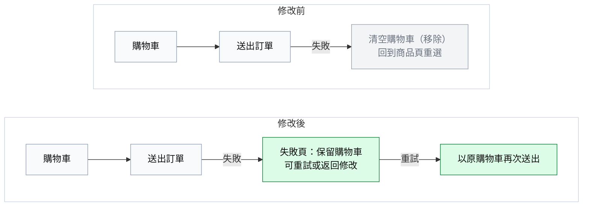
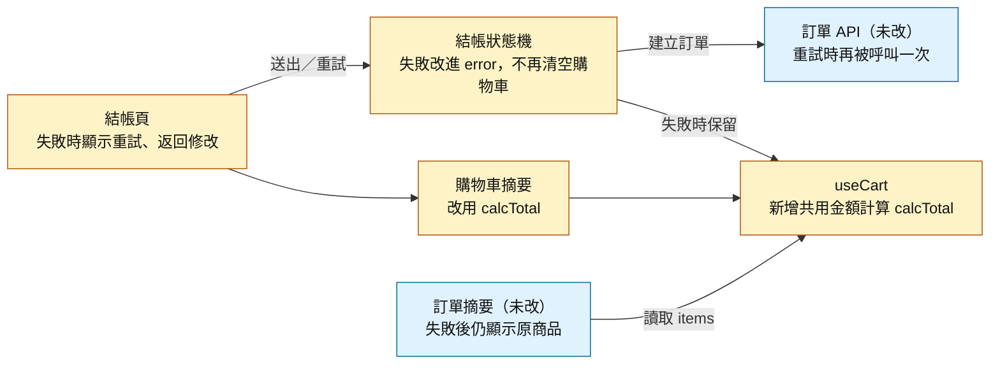
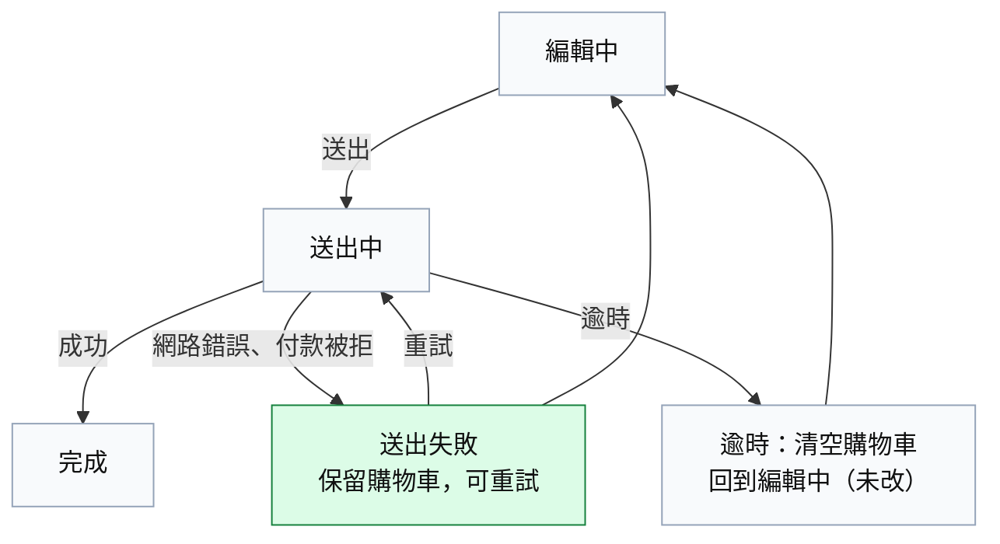

# 改動說明：結帳失敗後保留購物車

**草稿（尚未複核）**｜`main` ← `feature/keep-cart-on-failure`（`a1b2c3d4e5f6`）｜6 檔 +142／−38

## 一句話

送出訂單失敗後不再清空購物車，改為停在新的失敗頁，讓使用者重試或返回修改；購物車金額計算同時抽成共用 hook。重試會不會重複扣款，取決於後端是否去重【推測】。

## 圖 1：送出失敗時，修改前 vs 修改後

綠＝新增、灰＝移除。失敗不再把使用者送回商品頁；重試沿用同一份購物車。

## 圖 2：改動地圖

黃＝修改、藍＝沒改但受影響。訂單 API 與訂單摘要這次都沒改：前者在重試時會再被呼叫一次，後者在失敗後會繼續顯示原本的商品。

## 圖 3：送出後的狀態

綠＝新增。新增的 `error` 狀態只接網路錯誤與付款被拒；逾時仍走修改前的分支。

## 改動群組

| 群組 | 類型 | 改了什麼 |
| --- | --- | --- |
| 送出失敗保留購物車 | 行為變更 | 失敗後停在新的失敗頁，可重試或返回修改，購物車不再清空 |
| 購物車金額計算抽成 hook | 重構 | 結帳頁與購物車摘要改用同一份 `calcTotal` |
| 重試文案與測試 | 配套修改 | 新增重試按鈕文案與失敗狀態測試 |

> 比較範圍與逐項證據在 `detail.md`，需要追查時再看。
