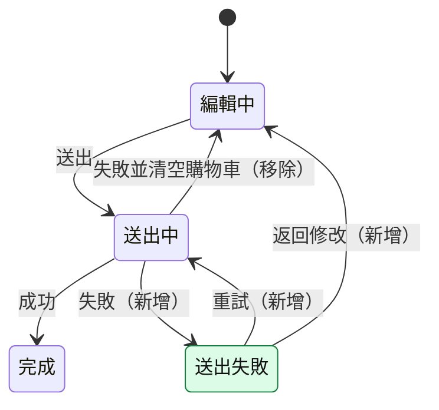
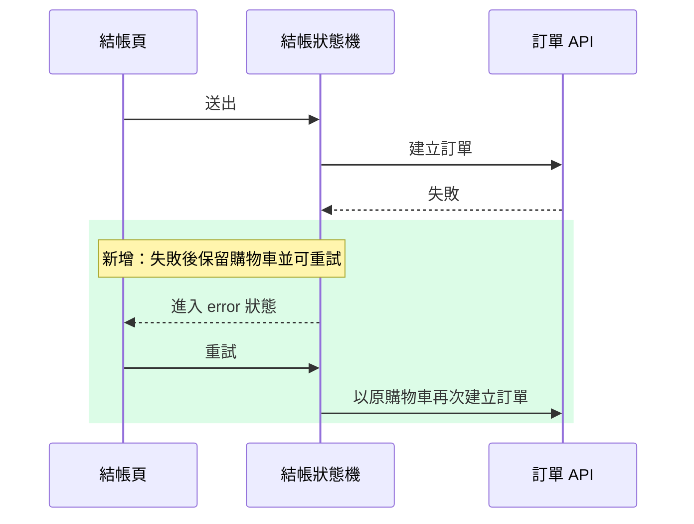

# 改動說明：結帳失敗後保留購物車

> 報告狀態：草稿（尚未複核）

## 比較範圍

| 項目 | 內容 |
| --- | --- |
| Repository | acme/shop-web（`/Users/dev/shop-web`） |
| Base | `main` → `3f9c2a7e1b4d`（PR #482 回報的 base） |
| Head | `feature/keep-cart-on-failure` → `a1b2c3d4e5f6`（PR #482 回報的 head） |
| Merge-base | `7e6f5d4c3b2a` |
| 比較方式 | merge-base 比較：`git diff 3f9c2a7e1b4d...a1b2c3d4e5f6` |
| 未提交改動 | 未包含 |
| 規模 | 6 個檔案，+142 / -38，4 個 commit |
| PR | [#482](https://github.com/acme/shop-web/pull/482)：範圍來源與需求來源 |
| 需求來源 | PR #482 描述（3 項驗收條件）；`openspec/changes/keep-cart-on-failure/specs/checkout/spec.md` |
| 備註 | 已執行 `git fetch origin pull/482/head` 取得 head commit；目前 checkout 為 `main`，程式碼一律以固定 SHA 讀取 |

## 1. 改動摘要

**一句話**：送出失敗後保留購物車並可直接重試【程式碼證實】[checkoutMachine.ts#L80-L97](https://github.com/acme/shop-web/blob/a1b2c3d4e5f60718293a4b5c6d7e8f9012345678/src/checkout/checkoutMachine.ts#L80-L97)，讓使用者不必重新選購【需求明訂】PR #482 描述「結帳失敗後不要清空購物車」。

### 改動群組

| 群組 | 類型 | 主要檔案 |
| --- | --- | --- |
| 送出失敗保留購物車並可重試 | 行為變更 | `checkoutMachine.ts`、`CheckoutPage.tsx` |
| 購物車金額計算抽成 hook | 重構 | `useCart.ts`、`CartSummary.tsx` |
| 重試文案與測試 | 配套修改 | `zh-TW.json`、`checkoutMachine.test.ts` |

### 送出失敗保留購物車並可重試（行為變更）

- 目的：送出失敗時保留使用者已選的商品，並讓使用者可以直接重試。
- 證據：修改前的錯誤轉移呼叫 `clearCart()`；修改後新增 `error` 狀態與 `RETRY` 轉移【程式碼證實】[修改前 checkoutMachine.ts#L52-L58](https://github.com/acme/shop-web/blob/7e6f5d4c3b2a19081726354a5b6c7d8e9f012345/src/checkout/checkoutMachine.ts#L52-L58)、[修改後 checkoutMachine.ts#L80-L97](https://github.com/acme/shop-web/blob/a1b2c3d4e5f60718293a4b5c6d7e8f9012345678/src/checkout/checkoutMachine.ts#L80-L97)。
- 不改的後果：網路失敗時，原本的錯誤處理會清空購物車，使用者需重新選購。

### 購物車金額計算抽成 hook（重構）

- 目的：讓結帳頁與購物車摘要共用同一份金額計算。
- 預期一致的行為：`calcTotal` 的輸入與輸出、四捨五入方式、空購物車回傳 0、折扣套用順序；`useCart` 的回傳形狀不變。
- 支持證據：修改前後的計算與四捨五入邏輯相同【程式碼證實】[修改前 CartSummary.tsx#L20-L34](https://github.com/acme/shop-web/blob/7e6f5d4c3b2a19081726354a5b6c7d8e9f012345/src/cart/CartSummary.tsx#L20-L34)、[修改後 useCart.ts#L12-L28](https://github.com/acme/shop-web/blob/a1b2c3d4e5f60718293a4b5c6d7e8f9012345678/src/cart/useCart.ts#L12-L28)。
- 尚未證實：折扣為負數的錯誤路徑沒有測試涵蓋。

### 重試文案與測試（配套修改）

- 目的：提供重試按鈕文案，並補上失敗狀態的測試。
- 證據：`zh-TW.json` 新增 2 個 key；`checkoutMachine.test.ts` 新增 3 個案例【程式碼證實】`diff.patch`。

## 2. 圖解改動

### 送出失敗後的狀態轉移

圖例：綠＝新增狀態；轉移標籤中的（新增）、（移除）表示新增與移除的轉移。

修改前，送出失敗會直接回到 `editing` 並清空購物車；修改後改為進入新增的 `error` 狀態，購物車保持不變，使用者可重試或返回修改。

### 重試時的呼叫順序

圖例：綠底區塊＝新增的訊息。

重試沿用原本的購物車內容再次呼叫訂單 API；是否會重複扣款取決於後端是否去重，目前無法從 repo 內的程式碼證實【推測】。
