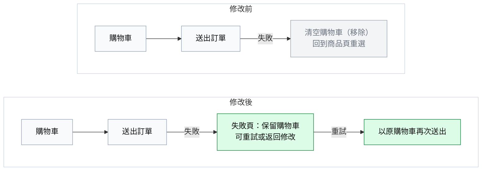
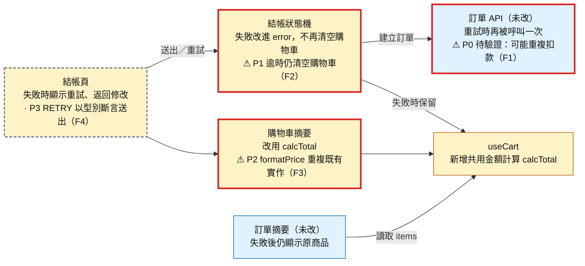
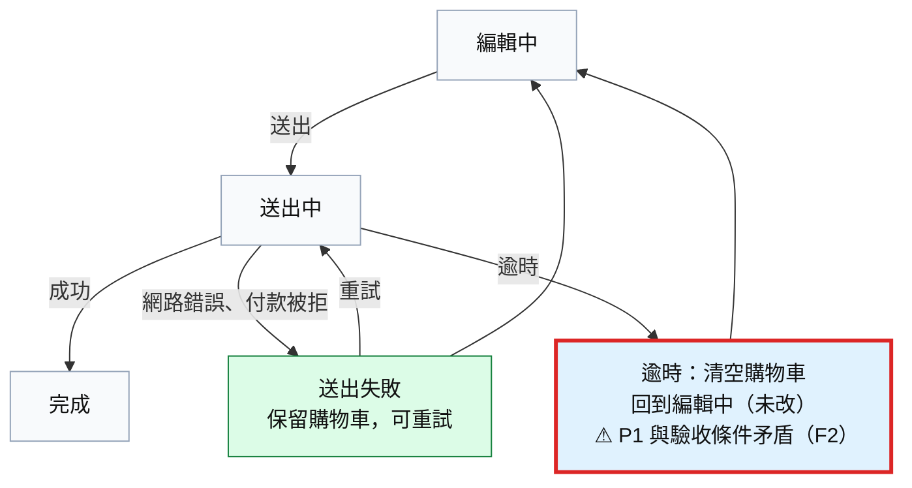

# Code Review：結帳失敗後保留購物車

**草稿（尚未複核）**｜`main` ← `feature/keep-cart-on-failure`（`a1b2c3d4e5f6`）｜6 檔 +142／−38｜**P0 1・P1 1・P2 1・P3 1**｜CI 通過；相關測試 12 項、ESLint 無新增問題

## 一句話

送出訂單失敗後不再清空購物車，改為停在新的失敗頁，讓使用者重試或返回修改；購物車金額計算同時抽成共用 hook。問題集中在兩處：**逾時錯誤仍走舊分支清空購物車**，以及**重試沒帶冪等鍵、可能重複扣款**（待後端確認）。

## 圖 1：送出失敗時，修改前 vs 修改後

綠＝新增、灰＝移除。失敗不再把使用者送回商品頁；重試沿用同一份購物車。

## 圖 2：改動地圖＋問題標在節點上

底色：黃＝修改、藍＝沒改但受影響。框線：紅色粗框＝有 P0–P2、灰色虛框＝只有 P3。

**看圖重點**：右上的藍底紅框。訂單 API 這次沒改，但新增的重試讓同一份購物車可能送出兩次，原本「一次送出只建立一筆訂單」的前提不再成立。

## 圖 3：送出後的狀態

綠＝新增；藍底紅框＝沒改但受這次改動影響，且有 P0–P2。新增的 `error` 狀態只接網路錯誤與付款被拒，逾時仍走修改前清空購物車的分支，與這次「失敗後保留購物車」的需求矛盾。

## 改動群組

| 群組 | 類型 | 改了什麼 |
| --- | --- | --- |
| 送出失敗保留購物車 | 行為變更 | 失敗後停在新的失敗頁，可重試或返回修改，購物車不再清空 |
| 購物車金額計算抽成 hook | 重構 | 結帳頁與購物車摘要改用同一份 `calcTotal` |
| 重試文案與測試 | 配套修改 | 新增重試按鈕文案與失敗狀態測試 |

## 要處理的問題

| 等級 | 問題 | 建議 | 詳細 |
| --- | --- | --- | --- |
| P0 | 逾時後重試可能重複扣款（待驗證） | 確認後端是否支援 `Idempotency-Key`，支援就在重試帶同一把鍵 | [F1](detail.md#f1) |
| P1 | 逾時錯誤仍會清空購物車 | 逾時也進入 `error` 狀態，不呼叫 `clearCart()` | [F2](detail.md#f2) |
| P2 | 新增的 `formatPrice` 與既有 `formatCurrency` 重複 | 改用 `formatCurrency` | [F3](detail.md#f3) |
| P3 | `RETRY` 事件以型別斷言送出 | 把 `RETRY` 加入 `CheckoutEvent` | [F4](detail.md#f4) |

## 待確認

- 後端訂單 API 會不會以訂單 ID 或冪等鍵去重？（決定 F1 是否成立）

## 驗證範圍

- **跑過**：CI（head `a1b2c3d4e5f6`）全部通過；相關 2 個測試檔 12 項、6 個變更檔 ESLint，都沒有新增問題。
- **沒驗**：後端去重行為、錯誤提示在螢幕閱讀器上的播報。

> 比較範圍、完整 findings 與審查涵蓋在 `detail.md`，需要追查時再看。
